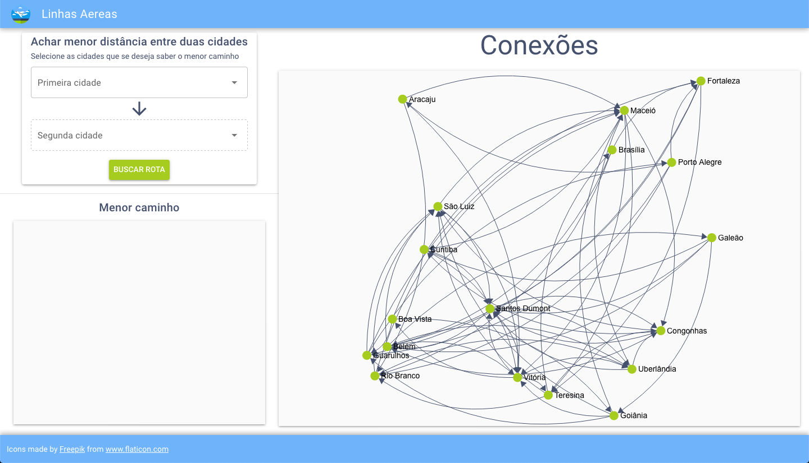
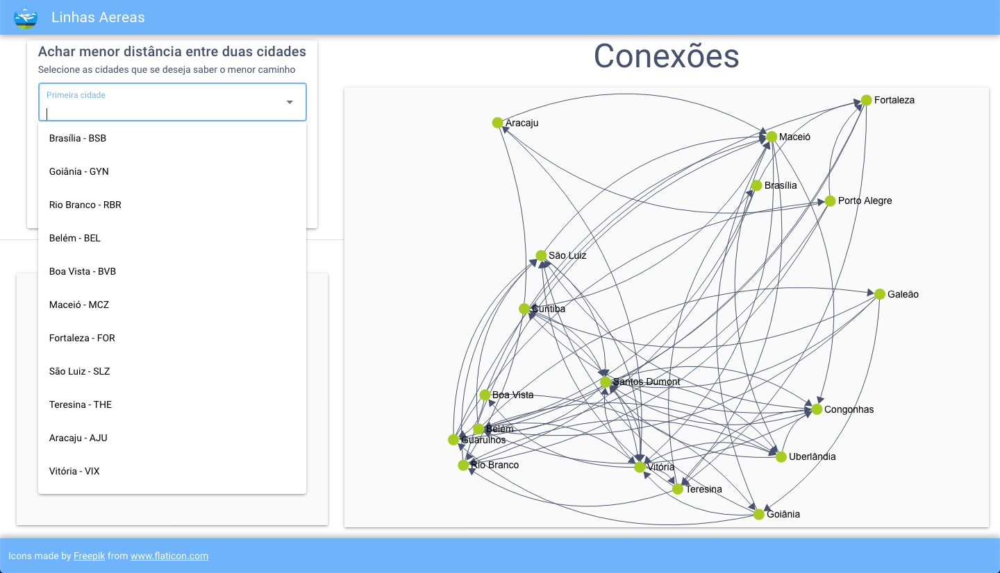
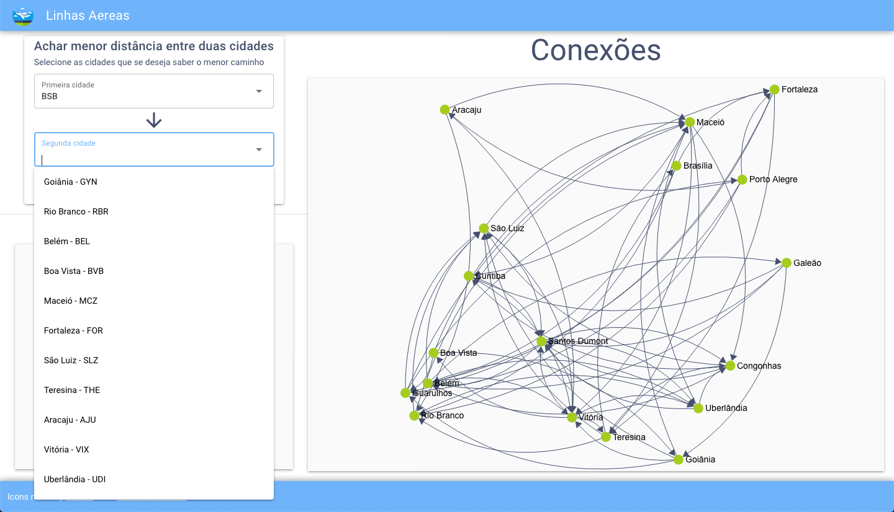
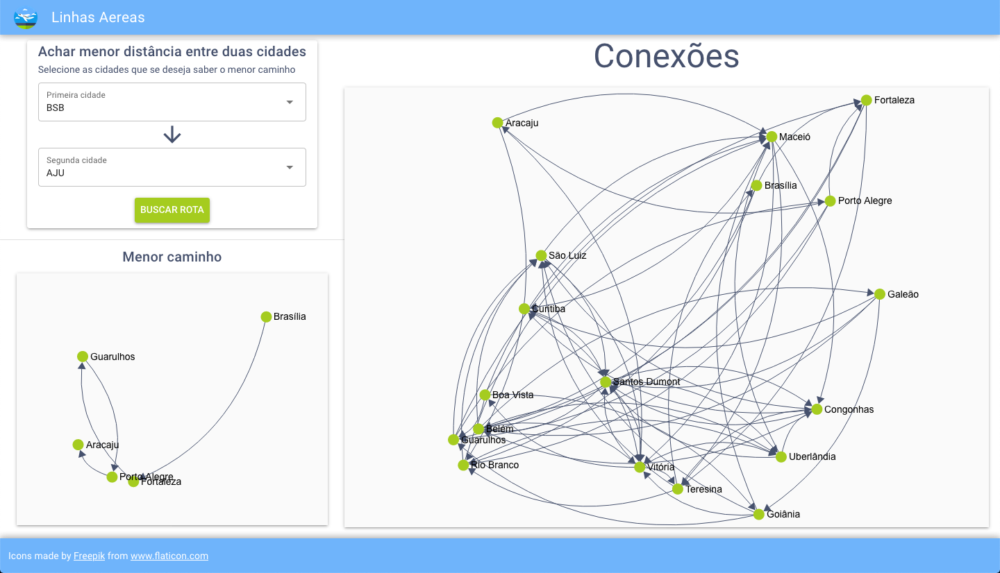

# Linhas Aereas

**Número da Lista**: 1<br>
**Conteúdo da Disciplina**: Grafos 1<br>

## Alunos
|Matrícula | Aluno |
| -- | -- |
| 18/0144979  |  Caetano Santos Lúcio |
| 14/0140034  |  Gabriel de Souza Clímaco |

## Sobre
O projeto consiste de uma aplicação para achar a menor conexão de linhas aereas entre duas cidades. O Grafo de linhas aéreas é gerado de forma aleatória.

## Screenshots






## Instalação
**Linguagem**: JavaScript<br>
**Framework**: [Quasar](https://quasar.dev/) ([Vue.js](https://vuejs.org/))<br>

## Uso

> OBS.: É recomendado o uso da versão estável mais recente até a presente data (12.18.3).

Garanta que o [yarn](https://yarnpkg.com/) está instalado:

```
npm i -g yarn
```

Após clonar o projeto, na pasta raiz, instale as dependências:

```
yarn
```

Feito isso, basta rodar o seguinte comando e a aplicação irá abrir em `http://localhost:8080`

```
npx quasar dev
```

## Outros

Foi utilizada a biblioteca [Sigma.js](https://github.com/jacomyal/sigma.js) para renderização dos grafos.
